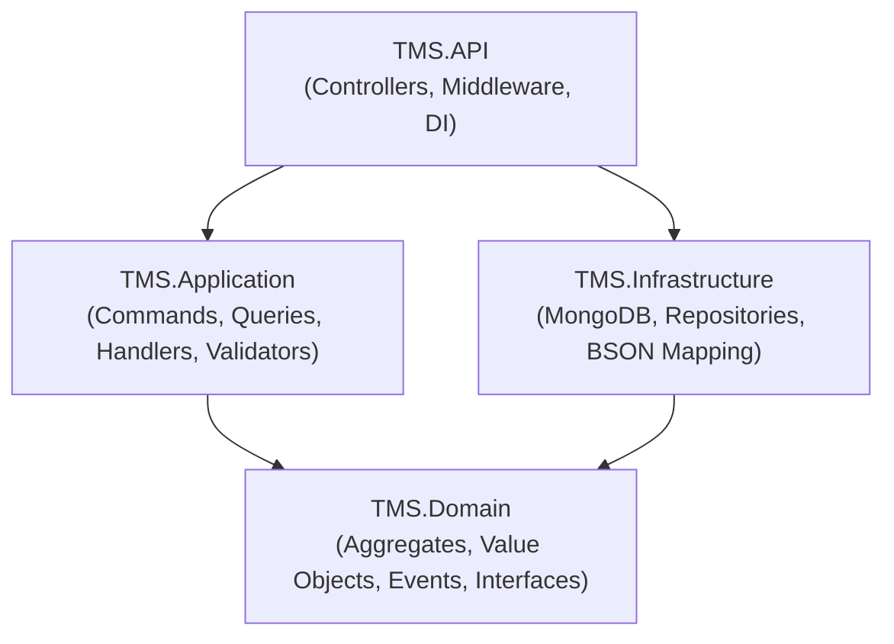
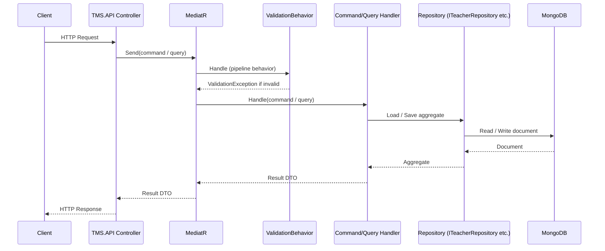
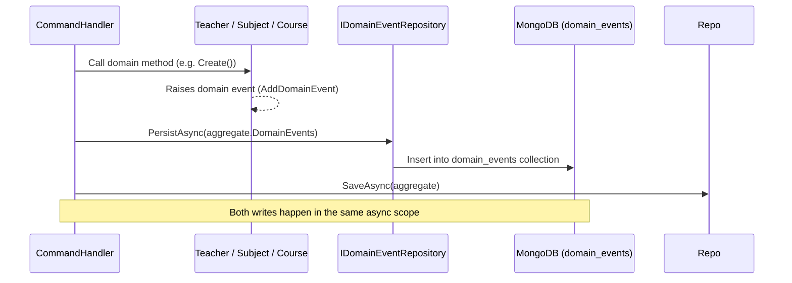

# Design Document: Teacher Management System (TMS)

## Overview

The Teacher Management System (TMS) is a .NET 8 / C# backend API that exposes HTTP endpoints for managing teacher profiles, subjects, courses, availability, and scheduling. It follows Domain-Driven Design (DDD) and Command Query Responsibility Segregation (CQRS) patterns, uses MediatR for in-process message dispatching, FluentValidation for input validation, and MongoDB as the persistence store.

The system is structured as a four-project solution (`TMS.API`, `TMS.Application`, `TMS.Domain`, `TMS.Infrastructure`) with a clear dependency flow that keeps domain logic free of infrastructure concerns. Domain events are raised inside the domain and persisted to a dedicated MongoDB collection as part of the same write operation that saves the aggregate, enabling downstream integrations without coupling.

---

## Architecture

> Architecture overview, layer dependency diagram, CQRS/MediatR flow, and domain event sequencing are detailed below in Part 1 (§1.2, §1.5, §1.6, §1.8).

## Data Models

> Aggregate roots, value objects, MongoDB collections, and all domain-layer C# types are defined below — see Part 1 (§1.3, §1.4) for the high-level model summary and Part 2 (§2.2–§2.8) for the complete C# implementations.

## Components and Interfaces

> All component responsibilities, repository interfaces, pipeline behaviors, controllers, and middleware are defined below — see Part 1 (§1.3) for the aggregate summary and Part 2 (§2.9, §2.13, §2.18, §2.19) for the full interface and implementation details.

## Error Handling

> Exception-to-HTTP-status mapping and the `GlobalExceptionMiddleware` implementation are defined below in Part 1 (§1.7) and Part 2 (§2.19).

## Correctness Properties

The following invariants hold throughout the system (full details in Part 2 §2.21):

### Property 1: Email Uniqueness
For all active teachers T1, T2 in the repository, `T1.Id ≠ T2.Id → T1.Email ≠ T2.Email`.

**Validates: Requirements 1.4**

### Property 2: Soft-Delete Visibility
A teacher where `IsDeleted = true` never appears in any query result.

**Validates: Requirements 3.3**

### Property 3: Schedule Conflict Prevention
For any teacher T, no two `ScheduleEntry` values in `T.ScheduleEntries` share the same `DayOfWeek` with overlapping time ranges.

**Validates: Requirements 8.3**

### Property 4: Availability Slot Validity
For any `AvailabilitySlot`, `StartTime < EndTime` always holds.

**Validates: Requirements 7.3**

### Property 5: Subject Assignment Uniqueness
For any teacher T, each `SubjectId` appears at most once in `T.SubjectAssignments`.

**Validates: Requirements 6.4**

### Property 6: Domain Event Consistency
Every successful write command that modifies an aggregate results in at least one domain event persisted to the `domain_events` collection.

**Validates: Requirements 10.6**

### Property 7: Delete Safety
A teacher with `ScheduleEntries.Count > 0` cannot be soft-deleted; `SoftDelete()` throws `DomainRuleException`.

**Validates: Requirements 3.4**

### Property 8: Subject Delete Safety
A subject assigned to at least one teacher cannot be soft-deleted; the handler throws `DomainRuleException`.

**Validates: Requirements 5.6**

### Property 9: Pagination Correctness
`PagedResult.TotalCount` equals the total number of documents matching the filter, regardless of page size.

**Validates: Requirements 4.5**

### Property 10: Event Ordering
Domain events in `IDomainEvent.OccurredAt` are monotonically non-decreasing within a single command execution.

**Validates: Requirements 10.6**

## Testing Strategy

> Unit, property-based, and integration testing strategies are described below in Part 2 (§2.22).

---

## Part 1 — High-Level Design

### 1.1 Solution Structure

```
TeacherManagementSystem.sln
├── src/
│   ├── TMS.Domain/          # Entities, value objects, domain events, repository interfaces
│   ├── TMS.Application/     # Commands, queries, handlers, DTOs, pipeline behaviors, validators
│   ├── TMS.Infrastructure/  # MongoDB context, repository implementations, BSON mappings
│   └── TMS.API/             # Controllers, middleware, DI wiring, Program.cs
└── tests/
    └── TMS.Tests/           # Unit + integration tests
```

### 1.2 Layer Responsibilities and Dependencies



**Dependency rules:**
- `TMS.Domain` has zero external dependencies — pure C# classes only.
- `TMS.Application` references `TMS.Domain` to use interfaces and domain types.
- `TMS.Infrastructure` references `TMS.Domain` to implement repository interfaces.
- `TMS.API` references `TMS.Application` and `TMS.Infrastructure` for DI wiring only.


### 1.3 Aggregate Roots, Entities, and Value Objects

| Type | Name | Lives In | Notes |
|---|---|---|---|
| Aggregate Root | `Teacher` | `TMS.Domain` | Central aggregate; owns subjects list, availability slots, schedule entries |
| Aggregate Root | `Subject` | `TMS.Domain` | Standalone aggregate; soft-deletable |
| Aggregate Root | `Course` | `TMS.Domain` | Standalone aggregate; holds course metadata |
| Value Object | `AvailabilitySlot` | `TMS.Domain` | `DayOfWeek`, `StartTime`, `EndTime`; immutable |
| Value Object | `ScheduleEntry` | `TMS.Domain` | `CourseId`, `DayOfWeek`, `StartTime`, `EndTime`; immutable |
| Value Object | `SubjectAssignment` | `TMS.Domain` | `SubjectId`, assigned date; immutable |

### 1.4 MongoDB Collections

| Collection | Stores | Notes |
|---|---|---|
| `teachers` | `Teacher` documents | Includes embedded `availabilitySlots[]`, `subjectAssignments[]`, `scheduleEntries[]` |
| `subjects` | `Subject` documents | Simple flat document |
| `courses` | `Course` documents | Course metadata only; teacher link lives inside Teacher aggregate |
| `domain_events` | `DomainEvent` documents | Append-only event log; written in same handler as aggregate save |

### 1.5 CQRS with MediatR

All write operations are **Commands** and all read operations are **Queries**. Both are dispatched via MediatR and handled in dedicated Handler classes inside `TMS.Application`.




### 1.6 MediatR Pipeline

```
HTTP Request
  └─► Controller.ActionMethod()
        └─► mediator.Send(command)
              └─► ValidationBehavior<TRequest, TResponse>   ← FluentValidation runs here
                    └─► CommandHandler / QueryHandler        ← business logic + persistence
```

- `ValidationBehavior<TRequest, TResponse>` calls all registered `IValidator<TRequest>` instances.
- If any validation fails, it throws a `ValidationException` before the handler is ever reached.
- `GlobalExceptionMiddleware` catches the exception and maps it to the appropriate HTTP status code.

### 1.7 Global Exception Middleware — Error Mapping

| Exception Type | HTTP Status | Scenario |
|---|---|---|
| `ValidationException` (FluentValidation) | 400 Bad Request | Missing / invalid fields |
| `NotFoundException` (custom) | 404 Not Found | Entity ID does not exist |
| `ConflictException` (custom) | 409 Conflict | Duplicate email / duplicate assignment |
| `DomainRuleException` (custom) | 422 Unprocessable Entity | Scheduling conflict, active assignments on delete |
| `Exception` (catch-all) | 500 Internal Server Error | Unhandled exception; logs with correlationId |

All error responses share a common JSON shape:

```json
{
  "correlationId": "3fa85f64-5717-4562-b3fc-2c963f66afa6",
  "status": 409,
  "error": "Conflict",
  "message": "A teacher with this email already exists.",
  "details": []
}
```

### 1.8 Domain Events Flow



Domain events are collected on the aggregate's `DomainEvents` list during the command handler execution. The handler persists them to MongoDB before (or immediately after) persisting the aggregate, keeping them in the same logical write scope.


---

## Part 2 — Low-Level Design

### 2.1 Full Folder / Namespace Structure

```
TMS.Domain/
├── Common/
│   ├── Entity.cs
│   └── IDomainEvent.cs
├── Aggregates/
│   ├── Teachers/
│   │   ├── Teacher.cs
│   │   └── Events/
│   │       ├── TeacherCreated.cs
│   │       ├── TeacherUpdated.cs
│   │       ├── TeacherDeleted.cs
│   │       ├── SubjectAssignedToTeacher.cs
│   │       └── TeacherAssignedToCourse.cs
│   ├── Subjects/
│   │   └── Subject.cs
│   └── Courses/
│       └── Course.cs
├── ValueObjects/
│   ├── AvailabilitySlot.cs
│   ├── ScheduleEntry.cs
│   └── SubjectAssignment.cs
├── Exceptions/
│   ├── NotFoundException.cs
│   ├── ConflictException.cs
│   └── DomainRuleException.cs
└── Repositories/
    ├── ITeacherRepository.cs
    ├── ISubjectRepository.cs
    ├── ICourseRepository.cs
    └── IDomainEventRepository.cs

TMS.Application/
├── Common/
│   ├── Behaviors/
│   │   └── ValidationBehavior.cs
│   └── Interfaces/
│       └── (re-exported from Domain for convenience, optional)
├── Teachers/
│   ├── Commands/
│   │   ├── CreateTeacher/
│   │   │   ├── CreateTeacherCommand.cs
│   │   │   ├── CreateTeacherCommandHandler.cs
│   │   │   └── CreateTeacherCommandValidator.cs
│   │   ├── UpdateTeacher/
│   │   │   ├── UpdateTeacherCommand.cs
│   │   │   ├── UpdateTeacherCommandHandler.cs
│   │   │   └── UpdateTeacherCommandValidator.cs
│   │   ├── DeleteTeacher/
│   │   │   ├── DeleteTeacherCommand.cs
│   │   │   └── DeleteTeacherCommandHandler.cs
│   │   ├── AssignSubjectToTeacher/
│   │   │   ├── AssignSubjectToTeacherCommand.cs
│   │   │   ├── AssignSubjectToTeacherCommandHandler.cs
│   │   │   └── AssignSubjectToTeacherCommandValidator.cs
│   │   ├── RemoveSubjectFromTeacher/
│   │   │   ├── RemoveSubjectFromTeacherCommand.cs
│   │   │   └── RemoveSubjectFromTeacherCommandHandler.cs
│   │   ├── SetTeacherAvailability/
│   │   │   ├── SetTeacherAvailabilityCommand.cs
│   │   │   ├── SetTeacherAvailabilityCommandHandler.cs
│   │   │   └── SetTeacherAvailabilityCommandValidator.cs
│   │   ├── AssignTeacherToCourse/
│   │   │   ├── AssignTeacherToCourseCommand.cs
│   │   │   ├── AssignTeacherToCourseCommandHandler.cs
│   │   │   └── AssignTeacherToCourseCommandValidator.cs
│   │   └── RemoveTeacherFromCourse/
│   │       ├── RemoveTeacherFromCourseCommand.cs
│   │       └── RemoveTeacherFromCourseCommandHandler.cs
│   ├── Queries/
│   │   ├── GetTeacherById/
│   │   │   ├── GetTeacherByIdQuery.cs
│   │   │   └── GetTeacherByIdQueryHandler.cs
│   │   ├── GetAllTeachers/
│   │   │   ├── GetAllTeachersQuery.cs
│   │   │   └── GetAllTeachersQueryHandler.cs
│   │   ├── GetTeacherAvailability/
│   │   │   ├── GetTeacherAvailabilityQuery.cs
│   │   │   └── GetTeacherAvailabilityQueryHandler.cs
│   │   ├── GetAvailableTeachers/
│   │   │   ├── GetAvailableTeachersQuery.cs
│   │   │   └── GetAvailableTeachersQueryHandler.cs
│   │   ├── GetSubjectsByTeacher/
│   │   │   ├── GetSubjectsByTeacherQuery.cs
│   │   │   └── GetSubjectsByTeacherQueryHandler.cs
│   │   └── GetTeacherSchedule/
│   │       ├── GetTeacherScheduleQuery.cs
│   │       └── GetTeacherScheduleQueryHandler.cs
│   └── DTOs/
│       ├── TeacherDto.cs
│       ├── TeacherSummaryDto.cs
│       ├── AvailabilitySlotDto.cs
│       └── ScheduleEntryDto.cs
├── Subjects/
│   ├── Commands/
│   │   ├── CreateSubject/
│   │   │   ├── CreateSubjectCommand.cs
│   │   │   ├── CreateSubjectCommandHandler.cs
│   │   │   └── CreateSubjectCommandValidator.cs
│   │   └── DeleteSubject/
│   │       ├── DeleteSubjectCommand.cs
│   │       └── DeleteSubjectCommandHandler.cs
│   ├── Queries/
│   │   └── GetAllSubjects/
│   │       ├── GetAllSubjectsQuery.cs
│   │       └── GetAllSubjectsQueryHandler.cs
│   └── DTOs/
│       └── SubjectDto.cs
└── Courses/
    └── DTOs/
        └── CourseDto.cs

TMS.Infrastructure/
├── Persistence/
│   ├── MongoDbContext.cs
│   ├── Mappings/
│   │   └── BsonMappingConfiguration.cs
│   └── Repositories/
│       ├── TeacherRepository.cs
│       ├── SubjectRepository.cs
│       ├── CourseRepository.cs
│       └── DomainEventRepository.cs
└── DependencyInjection.cs

TMS.API/
├── Controllers/
│   ├── TeachersController.cs
│   ├── SubjectsController.cs
│   └── CoursesController.cs
├── Middleware/
│   └── GlobalExceptionMiddleware.cs
├── Models/
│   └── ErrorResponse.cs
└── Program.cs
```


---

### 2.2 Domain Layer — Base Classes

#### `Entity.cs`

```csharp
namespace TMS.Domain.Common;

public abstract class Entity
{
    public Guid Id { get; protected set; }
    public DateTime CreatedAt { get; protected set; }
    public DateTime UpdatedAt { get; protected set; }

    private readonly List<IDomainEvent> _domainEvents = new();
    public IReadOnlyCollection<IDomainEvent> DomainEvents => _domainEvents.AsReadOnly();

    protected void AddDomainEvent(IDomainEvent domainEvent) => _domainEvents.Add(domainEvent);
    public void ClearDomainEvents() => _domainEvents.Clear();
}
```

#### `IDomainEvent.cs`

```csharp
namespace TMS.Domain.Common;

public interface IDomainEvent
{
    Guid EventId { get; }
    DateTime OccurredAt { get; }
    string EventType { get; }
}
```

---

### 2.3 Domain Layer — Value Objects

#### `AvailabilitySlot.cs`

```csharp
namespace TMS.Domain.ValueObjects;

public sealed class AvailabilitySlot
{
    public DayOfWeek DayOfWeek { get; }
    public TimeOnly StartTime { get; }
    public TimeOnly EndTime { get; }

    // Precondition: startTime must be strictly earlier than endTime
    public AvailabilitySlot(DayOfWeek dayOfWeek, TimeOnly startTime, TimeOnly endTime)
    {
        if (startTime >= endTime)
            throw new ArgumentException("StartTime must be earlier than EndTime.");

        DayOfWeek = dayOfWeek;
        StartTime = startTime;
        EndTime = endTime;
    }

    // Returns true when this slot overlaps with the given [start, end) range on the same day
    public bool Overlaps(DayOfWeek day, TimeOnly start, TimeOnly end) =>
        DayOfWeek == day && StartTime < end && EndTime > start;
}
```

#### `ScheduleEntry.cs`

```csharp
namespace TMS.Domain.ValueObjects;

public sealed class ScheduleEntry
{
    public Guid CourseId { get; }
    public DayOfWeek DayOfWeek { get; }
    public TimeOnly StartTime { get; }
    public TimeOnly EndTime { get; }

    // Precondition: startTime must be strictly earlier than endTime
    public ScheduleEntry(Guid courseId, DayOfWeek dayOfWeek, TimeOnly startTime, TimeOnly endTime)
    {
        if (startTime >= endTime)
            throw new ArgumentException("StartTime must be earlier than EndTime.");

        CourseId = courseId;
        DayOfWeek = dayOfWeek;
        StartTime = startTime;
        EndTime = endTime;
    }

    // Returns true when this schedule entry conflicts with the given time slot
    public bool ConflictsWith(DayOfWeek day, TimeOnly start, TimeOnly end) =>
        DayOfWeek == day && StartTime < end && EndTime > start;
}
```

#### `SubjectAssignment.cs`

```csharp
namespace TMS.Domain.ValueObjects;

public sealed class SubjectAssignment
{
    public Guid SubjectId { get; }
    public DateTime AssignedAt { get; }

    public SubjectAssignment(Guid subjectId)
    {
        if (subjectId == Guid.Empty)
            throw new ArgumentException("SubjectId cannot be empty.");

        SubjectId = subjectId;
        AssignedAt = DateTime.UtcNow;
    }
}
```


---

### 2.4 Domain Layer — Teacher Aggregate

```csharp
namespace TMS.Domain.Aggregates.Teachers;

public sealed class Teacher : Entity
{
    // ── Properties ─────────────────────────────────────────────────────────
    public string FirstName { get; private set; }
    public string LastName { get; private set; }
    public string Email { get; private set; }
    public string? PhoneNumber { get; private set; }
    public DateOnly? DateOfBirth { get; private set; }
    public string? Address { get; private set; }
    public bool IsDeleted { get; private set; }

    private readonly List<SubjectAssignment> _subjectAssignments = new();
    public IReadOnlyCollection<SubjectAssignment> SubjectAssignments => _subjectAssignments.AsReadOnly();

    private readonly List<AvailabilitySlot> _availabilitySlots = new();
    public IReadOnlyCollection<AvailabilitySlot> AvailabilitySlots => _availabilitySlots.AsReadOnly();

    private readonly List<ScheduleEntry> _scheduleEntries = new();
    public IReadOnlyCollection<ScheduleEntry> ScheduleEntries => _scheduleEntries.AsReadOnly();

    // Private constructor — only factory method can create instances
    private Teacher() { }

    // ── Factory Method ──────────────────────────────────────────────────────
    // Preconditions: firstName, lastName, email are non-empty
    // Postcondition: Returns valid Teacher with Id, CreatedAt, UpdatedAt set; TeacherCreated event raised
    public static Teacher Create(string firstName, string lastName, string email,
        string? phoneNumber = null, DateOnly? dateOfBirth = null, string? address = null)
    {
        var teacher = new Teacher
        {
            Id = Guid.NewGuid(),
            FirstName = firstName,
            LastName = lastName,
            Email = email,
            PhoneNumber = phoneNumber,
            DateOfBirth = dateOfBirth,
            Address = address,
            IsDeleted = false,
            CreatedAt = DateTime.UtcNow,
            UpdatedAt = DateTime.UtcNow
        };

        teacher.AddDomainEvent(new TeacherCreated(teacher.Id, firstName, lastName, email));
        return teacher;
    }

    // ── Update ──────────────────────────────────────────────────────────────
    // Precondition: at least one field is non-null
    // Postcondition: UpdatedAt refreshed; TeacherUpdated event raised with changed fields
    public void Update(string? firstName, string? lastName, string? email,
        string? phoneNumber, DateOnly? dateOfBirth, string? address)
    {
        if (firstName != null) FirstName = firstName;
        if (lastName != null) LastName = lastName;
        if (email != null) Email = email;
        if (phoneNumber != null) PhoneNumber = phoneNumber;
        if (dateOfBirth != null) DateOfBirth = dateOfBirth;
        if (address != null) Address = address;

        UpdatedAt = DateTime.UtcNow;
        AddDomainEvent(new TeacherUpdated(Id, firstName, lastName, email));
    }

    // ── Soft Delete ─────────────────────────────────────────────────────────
    // Precondition: teacher has no active schedule entries
    // Postcondition: IsDeleted = true; TeacherDeleted event raised
    public void SoftDelete()
    {
        if (_scheduleEntries.Count > 0)
            throw new DomainRuleException(
                "Teacher has active course assignments and cannot be deleted.");

        IsDeleted = true;
        UpdatedAt = DateTime.UtcNow;
        AddDomainEvent(new TeacherDeleted(Id));
    }

    // ── Assign Subject ──────────────────────────────────────────────────────
    // Precondition: subjectId not already assigned
    // Postcondition: SubjectAssignment added; SubjectAssignedToTeacher event raised
    public void AssignSubject(Guid subjectId)
    {
        if (_subjectAssignments.Any(a => a.SubjectId == subjectId))
            throw new ConflictException($"Subject {subjectId} is already assigned to this teacher.");

        _subjectAssignments.Add(new SubjectAssignment(subjectId));
        UpdatedAt = DateTime.UtcNow;
        AddDomainEvent(new SubjectAssignedToTeacher(Id, subjectId));
    }

    // ── Remove Subject ──────────────────────────────────────────────────────
    // Precondition: subjectId is currently assigned
    // Postcondition: SubjectAssignment removed
    public void RemoveSubject(Guid subjectId)
    {
        var assignment = _subjectAssignments.FirstOrDefault(a => a.SubjectId == subjectId)
            ?? throw new NotFoundException($"Subject {subjectId} is not assigned to this teacher.");

        _subjectAssignments.Remove(assignment);
        UpdatedAt = DateTime.UtcNow;
    }

    // ── Set Availability ────────────────────────────────────────────────────
    // Precondition: slots is non-null (may be empty to clear all)
    // Postcondition: _availabilitySlots replaced with new slots
    public void SetAvailability(IEnumerable<AvailabilitySlot> slots)
    {
        _availabilitySlots.Clear();
        _availabilitySlots.AddRange(slots);
        UpdatedAt = DateTime.UtcNow;
    }

    // ── Assign To Course ────────────────────────────────────────────────────
    // Precondition: no existing schedule entry conflicts with the new time slot
    // Postcondition: ScheduleEntry added; TeacherAssignedToCourse event raised
    public void AssignToCourse(Guid courseId, DayOfWeek day,
        TimeOnly startTime, TimeOnly endTime)
    {
        if (_scheduleEntries.Any(e => e.ConflictsWith(day, startTime, endTime)))
            throw new DomainRuleException(
                "The teacher already has a scheduled course that overlaps this time slot.");

        _scheduleEntries.Add(new ScheduleEntry(courseId, day, startTime, endTime));
        UpdatedAt = DateTime.UtcNow;
        AddDomainEvent(new TeacherAssignedToCourse(Id, courseId, day, startTime, endTime));
    }

    // ── Remove From Course ──────────────────────────────────────────────────
    // Precondition: courseId exists in scheduleEntries
    // Postcondition: ScheduleEntry removed
    public void RemoveFromCourse(Guid courseId)
    {
        var entry = _scheduleEntries.FirstOrDefault(e => e.CourseId == courseId)
            ?? throw new NotFoundException($"Course {courseId} is not assigned to this teacher.");

        _scheduleEntries.Remove(entry);
        UpdatedAt = DateTime.UtcNow;
    }
}
```


---

### 2.5 Domain Layer — Subject Aggregate

```csharp
namespace TMS.Domain.Aggregates.Subjects;

public sealed class Subject : Entity
{
    public string Name { get; private set; }
    public string? Description { get; private set; }
    public bool IsDeleted { get; private set; }

    private Subject() { }

    // Precondition: name is non-empty and ≤ 200 characters
    // Postcondition: new Subject with generated Id; no domain event raised (can be added if needed)
    public static Subject Create(string name, string? description = null)
    {
        return new Subject
        {
            Id = Guid.NewGuid(),
            Name = name,
            Description = description,
            IsDeleted = false,
            CreatedAt = DateTime.UtcNow,
            UpdatedAt = DateTime.UtcNow
        };
    }

    // Precondition: subject is not currently assigned to any teacher (enforced in handler)
    // Postcondition: IsDeleted = true
    public void SoftDelete()
    {
        IsDeleted = true;
        UpdatedAt = DateTime.UtcNow;
    }
}
```

---

### 2.6 Domain Layer — Course Aggregate

```csharp
namespace TMS.Domain.Aggregates.Courses;

public sealed class Course : Entity
{
    public string Name { get; private set; }
    public string? Description { get; private set; }
    public Guid SubjectId { get; private set; }
    public bool IsDeleted { get; private set; }

    private Course() { }

    // Precondition: name and subjectId are valid
    // Postcondition: new Course with generated Id
    public static Course Create(string name, Guid subjectId, string? description = null)
    {
        return new Course
        {
            Id = Guid.NewGuid(),
            Name = name,
            SubjectId = subjectId,
            Description = description,
            IsDeleted = false,
            CreatedAt = DateTime.UtcNow,
            UpdatedAt = DateTime.UtcNow
        };
    }
}
```

---

### 2.7 Domain Layer — Domain Events

```csharp
namespace TMS.Domain.Aggregates.Teachers.Events;

// Base record for all domain events
public abstract record DomainEventBase : IDomainEvent
{
    public Guid EventId { get; } = Guid.NewGuid();
    public DateTime OccurredAt { get; } = DateTime.UtcNow;
    public abstract string EventType { get; }
}

public record TeacherCreated(Guid TeacherId, string FirstName, string LastName, string Email)
    : DomainEventBase
{
    public override string EventType => nameof(TeacherCreated);
}

public record TeacherUpdated(Guid TeacherId, string? FirstName, string? LastName, string? Email)
    : DomainEventBase
{
    public override string EventType => nameof(TeacherUpdated);
}

public record TeacherDeleted(Guid TeacherId)
    : DomainEventBase
{
    public override string EventType => nameof(TeacherDeleted);
}

public record SubjectAssignedToTeacher(Guid TeacherId, Guid SubjectId)
    : DomainEventBase
{
    public override string EventType => nameof(SubjectAssignedToTeacher);
}

public record TeacherAssignedToCourse(
    Guid TeacherId,
    Guid CourseId,
    DayOfWeek DayOfWeek,
    TimeOnly StartTime,
    TimeOnly EndTime)
    : DomainEventBase
{
    public override string EventType => nameof(TeacherAssignedToCourse);
}
```

---

### 2.8 Domain Layer — Custom Exceptions

```csharp
namespace TMS.Domain.Exceptions;

public class NotFoundException : Exception
{
    public NotFoundException(string message) : base(message) { }
}

public class ConflictException : Exception
{
    public ConflictException(string message) : base(message) { }
}

public class DomainRuleException : Exception
{
    public DomainRuleException(string message) : base(message) { }
}
```

---

### 2.9 Domain Layer — Repository Interfaces

```csharp
namespace TMS.Domain.Repositories;

public interface ITeacherRepository
{
    Task<Teacher?> GetByIdAsync(Guid id, CancellationToken ct = default);
    Task<Teacher?> GetByEmailAsync(string email, CancellationToken ct = default);
    Task<(IReadOnlyList<Teacher> Items, int TotalCount)> GetPagedAsync(
        string? firstName, string? lastName, string? email, Guid? subjectId,
        int pageNumber, int pageSize, CancellationToken ct = default);
    Task<IReadOnlyList<Teacher>> GetAvailableAsync(
        DayOfWeek day, TimeOnly startTime, TimeOnly endTime, CancellationToken ct = default);
    Task AddAsync(Teacher teacher, CancellationToken ct = default);
    Task UpdateAsync(Teacher teacher, CancellationToken ct = default);
}

public interface ISubjectRepository
{
    Task<Subject?> GetByIdAsync(Guid id, CancellationToken ct = default);
    Task<Subject?> GetByNameAsync(string name, CancellationToken ct = default);
    Task<IReadOnlyList<Subject>> GetAllActiveAsync(CancellationToken ct = default);
    Task AddAsync(Subject subject, CancellationToken ct = default);
    Task UpdateAsync(Subject subject, CancellationToken ct = default);
    Task<bool> IsAssignedToAnyTeacherAsync(Guid subjectId, CancellationToken ct = default);
}

public interface ICourseRepository
{
    Task<Course?> GetByIdAsync(Guid id, CancellationToken ct = default);
    Task AddAsync(Course course, CancellationToken ct = default);
}

public interface IDomainEventRepository
{
    Task PersistAsync(IEnumerable<IDomainEvent> events, CancellationToken ct = default);
}
```


---

### 2.10 Application Layer — DTOs

```csharp
namespace TMS.Application.Teachers.DTOs;

public record TeacherDto(
    Guid Id,
    string FirstName,
    string LastName,
    string Email,
    string? PhoneNumber,
    DateOnly? DateOfBirth,
    string? Address,
    DateTime CreatedAt,
    DateTime UpdatedAt,
    IReadOnlyList<SubjectAssignmentDto> SubjectAssignments,
    IReadOnlyList<AvailabilitySlotDto> AvailabilitySlots,
    IReadOnlyList<ScheduleEntryDto> ScheduleEntries
);

public record TeacherSummaryDto(
    Guid Id,
    string FirstName,
    string LastName,
    string Email
);

public record AvailabilitySlotDto(DayOfWeek DayOfWeek, TimeOnly StartTime, TimeOnly EndTime);

public record ScheduleEntryDto(
    Guid CourseId,
    DayOfWeek DayOfWeek,
    TimeOnly StartTime,
    TimeOnly EndTime
);

public record SubjectAssignmentDto(Guid SubjectId, DateTime AssignedAt);

// ── Paged result wrapper ────────────────────────────────────────────────────
public record PagedResult<T>(
    IReadOnlyList<T> Items,
    int TotalCount,
    int PageNumber,
    int PageSize
);
```

---

### 2.11 Application Layer — Commands and Handlers

#### Create Teacher

```csharp
namespace TMS.Application.Teachers.Commands.CreateTeacher;

// Command — carries input data
public record CreateTeacherCommand(
    string FirstName,
    string LastName,
    string Email,
    string? PhoneNumber,
    DateOnly? DateOfBirth,
    string? Address
) : IRequest<TeacherDto>;

// Validator — runs via ValidationBehavior before handler
public class CreateTeacherCommandValidator : AbstractValidator<CreateTeacherCommand>
{
    public CreateTeacherCommandValidator()
    {
        RuleFor(x => x.FirstName).NotEmpty().MaximumLength(100);
        RuleFor(x => x.LastName).NotEmpty().MaximumLength(100);
        RuleFor(x => x.Email).NotEmpty().EmailAddress().MaximumLength(255);
        RuleFor(x => x.PhoneNumber).MaximumLength(20).When(x => x.PhoneNumber != null);
    }
}

// Handler — orchestrates domain + persistence
public class CreateTeacherCommandHandler : IRequestHandler<CreateTeacherCommand, TeacherDto>
{
    private readonly ITeacherRepository _teachers;
    private readonly IDomainEventRepository _events;

    public CreateTeacherCommandHandler(ITeacherRepository teachers, IDomainEventRepository events)
    {
        _teachers = teachers;
        _events = events;
    }

    public async Task<TeacherDto> Handle(CreateTeacherCommand cmd, CancellationToken ct)
    {
        // 1. Check email uniqueness
        var existing = await _teachers.GetByEmailAsync(cmd.Email, ct);
        if (existing != null)
            throw new ConflictException("A teacher with this email already exists.");

        // 2. Create aggregate (raises TeacherCreated domain event internally)
        var teacher = Teacher.Create(cmd.FirstName, cmd.LastName, cmd.Email,
            cmd.PhoneNumber, cmd.DateOfBirth, cmd.Address);

        // 3. Persist domain events first, then aggregate
        await _events.PersistAsync(teacher.DomainEvents, ct);
        await _teachers.AddAsync(teacher, ct);

        teacher.ClearDomainEvents();
        return teacher.ToDto(); // extension method for mapping
    }
}
```

#### Update Teacher

```csharp
namespace TMS.Application.Teachers.Commands.UpdateTeacher;

public record UpdateTeacherCommand(
    Guid TeacherId,
    string? FirstName,
    string? LastName,
    string? Email,
    string? PhoneNumber,
    DateOnly? DateOfBirth,
    string? Address
) : IRequest<TeacherDto>;

public class UpdateTeacherCommandValidator : AbstractValidator<UpdateTeacherCommand>
{
    public UpdateTeacherCommandValidator()
    {
        RuleFor(x => x.TeacherId).NotEmpty();
        // At least one updatable field must be provided
        RuleFor(x => x).Must(cmd =>
            cmd.FirstName != null || cmd.LastName != null || cmd.Email != null ||
            cmd.PhoneNumber != null || cmd.DateOfBirth != null || cmd.Address != null)
            .WithMessage("At least one updatable field must be provided.");
        RuleFor(x => x.Email).EmailAddress().When(x => x.Email != null);
    }
}

// Handler signature
public class UpdateTeacherCommandHandler : IRequestHandler<UpdateTeacherCommand, TeacherDto>
{
    // 1. Load teacher by ID → throw NotFoundException if not found
    // 2. If email changed: check uniqueness → throw ConflictException if taken
    // 3. Call teacher.Update(...)
    // 4. Persist domain events, then UpdateAsync
    public Task<TeacherDto> Handle(UpdateTeacherCommand cmd, CancellationToken ct) => throw new NotImplementedException();
}
```

#### Delete Teacher

```csharp
namespace TMS.Application.Teachers.Commands.DeleteTeacher;

public record DeleteTeacherCommand(Guid TeacherId) : IRequest;

// Handler signature
public class DeleteTeacherCommandHandler : IRequestHandler<DeleteTeacherCommand>
{
    // 1. Load teacher → throw NotFoundException if not found
    // 2. Call teacher.SoftDelete() → throws DomainRuleException if active assignments exist
    // 3. Persist domain events, then UpdateAsync
    public Task Handle(DeleteTeacherCommand cmd, CancellationToken ct) => throw new NotImplementedException();
}
```

#### Assign / Remove Subject

```csharp
// Commands
public record AssignSubjectToTeacherCommand(Guid TeacherId, Guid SubjectId) : IRequest;
public record RemoveSubjectFromTeacherCommand(Guid TeacherId, Guid SubjectId) : IRequest;

public class AssignSubjectToTeacherCommandValidator : AbstractValidator<AssignSubjectToTeacherCommand>
{
    public AssignSubjectToTeacherCommandValidator()
    {
        RuleFor(x => x.TeacherId).NotEmpty();
        RuleFor(x => x.SubjectId).NotEmpty();
    }
}

// AssignSubjectToTeacherCommandHandler
// 1. Load teacher → NotFoundException if missing
// 2. Load subject → NotFoundException if missing or soft-deleted
// 3. teacher.AssignSubject(subjectId) → ConflictException if already assigned
// 4. Persist events + UpdateAsync

// RemoveSubjectFromTeacherCommandHandler
// 1. Load teacher → NotFoundException if missing
// 2. teacher.RemoveSubject(subjectId) → NotFoundException if not assigned
// 3. UpdateAsync (no domain event for removal defined in requirements)
```

#### Set Teacher Availability

```csharp
public record AvailabilitySlotInput(DayOfWeek DayOfWeek, TimeOnly StartTime, TimeOnly EndTime);

public record SetTeacherAvailabilityCommand(
    Guid TeacherId,
    IReadOnlyList<AvailabilitySlotInput> Slots
) : IRequest;

public class SetTeacherAvailabilityCommandValidator : AbstractValidator<SetTeacherAvailabilityCommand>
{
    public SetTeacherAvailabilityCommandValidator()
    {
        RuleFor(x => x.TeacherId).NotEmpty();
        RuleForEach(x => x.Slots).ChildRules(slot =>
        {
            slot.RuleFor(s => s.StartTime).LessThan(s => s.EndTime)
                .WithMessage("StartTime must be earlier than EndTime.");
        });
    }
}

// SetTeacherAvailabilityCommandHandler
// 1. Load teacher → NotFoundException if missing
// 2. Map inputs to AvailabilitySlot value objects
// 3. teacher.SetAvailability(slots)
// 4. UpdateAsync
```

#### Assign / Remove Teacher From Course

```csharp
public record AssignTeacherToCourseCommand(
    Guid TeacherId,
    Guid CourseId,
    DayOfWeek DayOfWeek,
    TimeOnly StartTime,
    TimeOnly EndTime
) : IRequest;

public class AssignTeacherToCourseCommandValidator : AbstractValidator<AssignTeacherToCourseCommand>
{
    public AssignTeacherToCourseCommandValidator()
    {
        RuleFor(x => x.TeacherId).NotEmpty();
        RuleFor(x => x.CourseId).NotEmpty();
        RuleFor(x => x.StartTime).LessThan(x => x.EndTime)
            .WithMessage("StartTime must be earlier than EndTime.");
    }
}

// AssignTeacherToCourseCommandHandler
// 1. Load teacher → NotFoundException if missing
// 2. Load course → NotFoundException if missing
// 3. teacher.AssignToCourse(courseId, day, start, end)
//    → DomainRuleException if schedule conflict detected inside aggregate
// 4. Persist events + UpdateAsync

public record RemoveTeacherFromCourseCommand(Guid TeacherId, Guid CourseId) : IRequest;

// RemoveTeacherFromCourseCommandHandler
// 1. Load teacher → NotFoundException if missing
// 2. teacher.RemoveFromCourse(courseId) → NotFoundException if not found
// 3. UpdateAsync
```

#### Create / Delete Subject

```csharp
public record CreateSubjectCommand(string Name, string? Description) : IRequest<SubjectDto>;

public class CreateSubjectCommandValidator : AbstractValidator<CreateSubjectCommand>
{
    public CreateSubjectCommandValidator()
    {
        RuleFor(x => x.Name).NotEmpty().MaximumLength(200);
    }
}

// CreateSubjectCommandHandler
// 1. Check name uniqueness → ConflictException if taken
// 2. Subject.Create(name, description)
// 3. AddAsync

public record DeleteSubjectCommand(Guid SubjectId) : IRequest;

// DeleteSubjectCommandHandler
// 1. Load subject → NotFoundException if missing
// 2. Check if assigned to any teacher → DomainRuleException if true
// 3. subject.SoftDelete() + UpdateAsync
```


---

### 2.12 Application Layer — Queries and Handlers

```csharp
namespace TMS.Application.Teachers.Queries;

// ── Get single teacher ──────────────────────────────────────────────────────
public record GetTeacherByIdQuery(Guid TeacherId) : IRequest<TeacherDto>;

// Handler: Load by ID → NotFoundException if missing or soft-deleted → map to TeacherDto

// ── Get paged list of teachers ──────────────────────────────────────────────
public record GetAllTeachersQuery(
    string? FirstName,
    string? LastName,
    string? Email,
    Guid? SubjectId,
    int PageNumber = 1,
    int PageSize = 20
) : IRequest<PagedResult<TeacherSummaryDto>>;

// Handler: Call repository.GetPagedAsync with filters → map items to TeacherSummaryDto

// ── Get teacher availability ────────────────────────────────────────────────
public record GetTeacherAvailabilityQuery(Guid TeacherId)
    : IRequest<IReadOnlyList<AvailabilitySlotDto>>;

// Handler: Load teacher → return AvailabilitySlots mapped to DTOs

// ── Get available teachers for a time slot ──────────────────────────────────
public record GetAvailableTeachersQuery(DayOfWeek DayOfWeek, TimeOnly StartTime, TimeOnly EndTime)
    : IRequest<IReadOnlyList<TeacherSummaryDto>>;

// Handler: repository.GetAvailableAsync → filter teachers whose availability overlaps → map to DTOs

// ── Get subjects assigned to teacher ───────────────────────────────────────
public record GetSubjectsByTeacherQuery(Guid TeacherId)
    : IRequest<IReadOnlyList<SubjectDto>>;

// Handler: Load teacher → load each SubjectId → map to SubjectDto

// ── Get teacher schedule ────────────────────────────────────────────────────
public record GetTeacherScheduleQuery(Guid TeacherId, DayOfWeek? DayOfWeek = null)
    : IRequest<IReadOnlyList<ScheduleEntryDto>>;

// Handler: Load teacher → filter ScheduleEntries by DayOfWeek if provided → map to DTOs

// ── Get all subjects ─────────────────────────────────────────────────────────
public record GetAllSubjectsQuery : IRequest<IReadOnlyList<SubjectDto>>;

// Handler: subjectRepository.GetAllActiveAsync → map to SubjectDto
```

---

### 2.13 Application Layer — ValidationBehavior Pipeline

```csharp
namespace TMS.Application.Common.Behaviors;

// This class is registered as a MediatR IPipelineBehavior.
// It runs automatically before every command/query handler.
public class ValidationBehavior<TRequest, TResponse>
    : IPipelineBehavior<TRequest, TResponse>
    where TRequest : IRequest<TResponse>
{
    private readonly IEnumerable<IValidator<TRequest>> _validators;

    public ValidationBehavior(IEnumerable<IValidator<TRequest>> validators)
    {
        _validators = validators;
    }

    public async Task<TResponse> Handle(
        TRequest request,
        RequestHandlerDelegate<TResponse> next,
        CancellationToken cancellationToken)
    {
        if (!_validators.Any()) return await next();

        // Run all validators for this request type
        var context = new ValidationContext<TRequest>(request);
        var results = await Task.WhenAll(
            _validators.Select(v => v.ValidateAsync(context, cancellationToken)));

        // Collect all failures
        var failures = results
            .SelectMany(r => r.Errors)
            .Where(f => f != null)
            .ToList();

        if (failures.Count > 0)
            throw new ValidationException(failures); // caught by GlobalExceptionMiddleware → 400

        return await next(); // continue to handler
    }
}
```


---

### 2.14 Infrastructure Layer — MongoDbContext

```csharp
namespace TMS.Infrastructure.Persistence;

public class MongoDbContext
{
    private readonly IMongoDatabase _database;

    public MongoDbContext(IOptions<MongoDbSettings> settings)
    {
        var client = new MongoClient(settings.Value.ConnectionString);
        _database = client.GetDatabase(settings.Value.DatabaseName);
    }

    // One property per collection — strongly typed
    public IMongoCollection<Teacher> Teachers =>
        _database.GetCollection<Teacher>("teachers");

    public IMongoCollection<Subject> Subjects =>
        _database.GetCollection<Subject>("subjects");

    public IMongoCollection<Course> Courses =>
        _database.GetCollection<Course>("courses");

    public IMongoCollection<DomainEventDocument> DomainEvents =>
        _database.GetCollection<DomainEventDocument>("domain_events");
}

// Settings class bound from appsettings.json
public class MongoDbSettings
{
    public string ConnectionString { get; set; } = string.Empty;
    public string DatabaseName { get; set; } = string.Empty;
}
```

---

### 2.15 Infrastructure Layer — BSON Mapping Configuration

```csharp
namespace TMS.Infrastructure.Persistence.Mappings;

// Call this once at startup before any MongoDB operations
public static class BsonMappingConfiguration
{
    public static void Configure()
    {
        // Map Guid as string (readable in MongoDB Compass)
        BsonSerializer.RegisterSerializer(new GuidSerializer(GuidRepresentation.Standard));

        // Map TimeOnly as string "HH:mm:ss"
        BsonSerializer.RegisterSerializer(new TimeOnlySerializer());

        // Map DateOnly as string "yyyy-MM-dd"
        BsonSerializer.RegisterSerializer(new DateOnlySerializer());

        // Teacher aggregate map
        if (!BsonClassMap.IsClassMapRegistered(typeof(Teacher)))
        {
            BsonClassMap.RegisterClassMap<Teacher>(cm =>
            {
                cm.AutoMap();
                cm.SetIgnoreExtraElements(true);
                cm.MapIdMember(t => t.Id);
                // DomainEvents are NOT persisted inside the aggregate document
                cm.UnmapMember(t => t.DomainEvents);
            });
        }

        // Subject and Course follow the same pattern (AutoMap + ignore DomainEvents)
    }
}
```

---

### 2.16 Infrastructure Layer — Repository Implementations

```csharp
namespace TMS.Infrastructure.Persistence.Repositories;

public class TeacherRepository : ITeacherRepository
{
    private readonly MongoDbContext _ctx;

    public TeacherRepository(MongoDbContext ctx) => _ctx = ctx;

    public async Task<Teacher?> GetByIdAsync(Guid id, CancellationToken ct)
        => await _ctx.Teachers
            .Find(t => t.Id == id && !t.IsDeleted)
            .FirstOrDefaultAsync(ct);

    public async Task<Teacher?> GetByEmailAsync(string email, CancellationToken ct)
        => await _ctx.Teachers
            .Find(t => t.Email == email && !t.IsDeleted)
            .FirstOrDefaultAsync(ct);

    public async Task<(IReadOnlyList<Teacher> Items, int TotalCount)> GetPagedAsync(
        string? firstName, string? lastName, string? email, Guid? subjectId,
        int pageNumber, int pageSize, CancellationToken ct)
    {
        // Build a filter combining all non-null filter parameters
        var builder = Builders<Teacher>.Filter;
        var filter = builder.Eq(t => t.IsDeleted, false);

        if (!string.IsNullOrWhiteSpace(firstName))
            filter &= builder.Regex(t => t.FirstName, new BsonRegularExpression(firstName, "i"));
        if (!string.IsNullOrWhiteSpace(lastName))
            filter &= builder.Regex(t => t.LastName, new BsonRegularExpression(lastName, "i"));
        if (!string.IsNullOrWhiteSpace(email))
            filter &= builder.Regex(t => t.Email, new BsonRegularExpression(email, "i"));
        if (subjectId.HasValue)
            filter &= builder.ElemMatch(t => t.SubjectAssignments,
                Builders<SubjectAssignment>.Filter.Eq(a => a.SubjectId, subjectId.Value));

        var totalCount = (int)await _ctx.Teachers.CountDocumentsAsync(filter, cancellationToken: ct);
        var items = await _ctx.Teachers.Find(filter)
            .Skip((pageNumber - 1) * pageSize)
            .Limit(pageSize)
            .ToListAsync(ct);

        return (items, totalCount);
    }

    public async Task<IReadOnlyList<Teacher>> GetAvailableAsync(
        DayOfWeek day, TimeOnly startTime, TimeOnly endTime, CancellationToken ct)
    {
        // Find teachers whose availability includes the requested day and overlapping time range
        // MongoDB query uses ElemMatch on availabilitySlots array
        var filter = Builders<Teacher>.Filter.And(
            Builders<Teacher>.Filter.Eq(t => t.IsDeleted, false),
            Builders<Teacher>.Filter.ElemMatch(t => t.AvailabilitySlots,
                Builders<AvailabilitySlot>.Filter.And(
                    Builders<AvailabilitySlot>.Filter.Eq(s => s.DayOfWeek, day),
                    Builders<AvailabilitySlot>.Filter.Lt(s => s.StartTime, endTime),
                    Builders<AvailabilitySlot>.Filter.Gt(s => s.EndTime, startTime)
                ))
        );

        return await _ctx.Teachers.Find(filter).ToListAsync(ct);
    }

    public async Task AddAsync(Teacher teacher, CancellationToken ct)
        => await _ctx.Teachers.InsertOneAsync(teacher, cancellationToken: ct);

    public async Task UpdateAsync(Teacher teacher, CancellationToken ct)
        => await _ctx.Teachers.ReplaceOneAsync(
            t => t.Id == teacher.Id, teacher, cancellationToken: ct);
}
```

#### Domain Event Repository

```csharp
namespace TMS.Infrastructure.Persistence.Repositories;

// Persists domain event records to the domain_events collection
public class DomainEventRepository : IDomainEventRepository
{
    private readonly MongoDbContext _ctx;

    public DomainEventRepository(MongoDbContext ctx) => _ctx = ctx;

    public async Task PersistAsync(IEnumerable<IDomainEvent> events, CancellationToken ct)
    {
        var documents = events.Select(e => new DomainEventDocument
        {
            Id = e.EventId,
            EventType = e.EventType,
            OccurredAt = e.OccurredAt,
            Payload = e.ToJson() // serialize the full event record as JSON string
        }).ToList();

        if (documents.Count > 0)
            await _ctx.DomainEvents.InsertManyAsync(documents, cancellationToken: ct);
    }
}

// Document stored in domain_events collection
public class DomainEventDocument
{
    [BsonId]
    public Guid Id { get; set; }
    public string EventType { get; set; } = string.Empty;
    public DateTime OccurredAt { get; set; }
    public string Payload { get; set; } = string.Empty; // serialized JSON of the event
}
```

---

### 2.17 Infrastructure Layer — DI Registration

```csharp
namespace TMS.Infrastructure;

public static class DependencyInjection
{
    public static IServiceCollection AddInfrastructure(
        this IServiceCollection services,
        IConfiguration configuration)
    {
        // Bind MongoDB settings from appsettings.json
        services.Configure<MongoDbSettings>(
            configuration.GetSection("MongoDB"));

        // Register context and repositories
        services.AddSingleton<MongoDbContext>();
        services.AddScoped<ITeacherRepository, TeacherRepository>();
        services.AddScoped<ISubjectRepository, SubjectRepository>();
        services.AddScoped<ICourseRepository, CourseRepository>();
        services.AddScoped<IDomainEventRepository, DomainEventRepository>();

        return services;
    }
}
```


---

### 2.18 API Layer — Controllers

#### TeachersController

```csharp
namespace TMS.API.Controllers;

[ApiController]
[Route("api/teachers")]
public class TeachersController : ControllerBase
{
    private readonly ISender _mediator;

    public TeachersController(ISender mediator) => _mediator = mediator;

    // POST /api/teachers
    [HttpPost]
    [ProducesResponseType(typeof(TeacherDto), StatusCodes.Status201Created)]
    public async Task<IActionResult> Create([FromBody] CreateTeacherCommand cmd, CancellationToken ct)
    {
        var result = await _mediator.Send(cmd, ct);
        return CreatedAtAction(nameof(GetById), new { id = result.Id }, result);
    }

    // GET /api/teachers/{id}
    [HttpGet("{id:guid}")]
    [ProducesResponseType(typeof(TeacherDto), StatusCodes.Status200OK)]
    public async Task<IActionResult> GetById(Guid id, CancellationToken ct)
        => Ok(await _mediator.Send(new GetTeacherByIdQuery(id), ct));

    // GET /api/teachers?firstName=&lastName=&email=&subjectId=&pageNumber=1&pageSize=20
    [HttpGet]
    [ProducesResponseType(typeof(PagedResult<TeacherSummaryDto>), StatusCodes.Status200OK)]
    public async Task<IActionResult> GetAll([FromQuery] GetAllTeachersQuery query, CancellationToken ct)
        => Ok(await _mediator.Send(query, ct));

    // PUT /api/teachers/{id}
    [HttpPut("{id:guid}")]
    [ProducesResponseType(typeof(TeacherDto), StatusCodes.Status200OK)]
    public async Task<IActionResult> Update(Guid id, [FromBody] UpdateTeacherCommand cmd, CancellationToken ct)
        => Ok(await _mediator.Send(cmd with { TeacherId = id }, ct));

    // DELETE /api/teachers/{id}
    [HttpDelete("{id:guid}")]
    [ProducesResponseType(StatusCodes.Status204NoContent)]
    public async Task<IActionResult> Delete(Guid id, CancellationToken ct)
    {
        await _mediator.Send(new DeleteTeacherCommand(id), ct);
        return NoContent();
    }

    // POST /api/teachers/{id}/subjects
    [HttpPost("{id:guid}/subjects")]
    [ProducesResponseType(StatusCodes.Status204NoContent)]
    public async Task<IActionResult> AssignSubject(Guid id, [FromBody] AssignSubjectRequest req, CancellationToken ct)
    {
        await _mediator.Send(new AssignSubjectToTeacherCommand(id, req.SubjectId), ct);
        return NoContent();
    }

    // DELETE /api/teachers/{id}/subjects/{subjectId}
    [HttpDelete("{id:guid}/subjects/{subjectId:guid}")]
    [ProducesResponseType(StatusCodes.Status204NoContent)]
    public async Task<IActionResult> RemoveSubject(Guid id, Guid subjectId, CancellationToken ct)
    {
        await _mediator.Send(new RemoveSubjectFromTeacherCommand(id, subjectId), ct);
        return NoContent();
    }

    // GET /api/teachers/{id}/subjects
    [HttpGet("{id:guid}/subjects")]
    [ProducesResponseType(typeof(IReadOnlyList<SubjectDto>), StatusCodes.Status200OK)]
    public async Task<IActionResult> GetSubjects(Guid id, CancellationToken ct)
        => Ok(await _mediator.Send(new GetSubjectsByTeacherQuery(id), ct));

    // PUT /api/teachers/{id}/availability
    [HttpPut("{id:guid}/availability")]
    [ProducesResponseType(StatusCodes.Status204NoContent)]
    public async Task<IActionResult> SetAvailability(
        Guid id, [FromBody] SetTeacherAvailabilityCommand cmd, CancellationToken ct)
    {
        await _mediator.Send(cmd with { TeacherId = id }, ct);
        return NoContent();
    }

    // GET /api/teachers/{id}/availability
    [HttpGet("{id:guid}/availability")]
    [ProducesResponseType(typeof(IReadOnlyList<AvailabilitySlotDto>), StatusCodes.Status200OK)]
    public async Task<IActionResult> GetAvailability(Guid id, CancellationToken ct)
        => Ok(await _mediator.Send(new GetTeacherAvailabilityQuery(id), ct));

    // GET /api/teachers/available?dayOfWeek=Monday&startTime=09:00&endTime=11:00
    [HttpGet("available")]
    [ProducesResponseType(typeof(IReadOnlyList<TeacherSummaryDto>), StatusCodes.Status200OK)]
    public async Task<IActionResult> GetAvailable(
        [FromQuery] GetAvailableTeachersQuery query, CancellationToken ct)
        => Ok(await _mediator.Send(query, ct));

    // POST /api/teachers/{id}/courses
    [HttpPost("{id:guid}/courses")]
    [ProducesResponseType(StatusCodes.Status204NoContent)]
    public async Task<IActionResult> AssignToCourse(
        Guid id, [FromBody] AssignTeacherToCourseCommand cmd, CancellationToken ct)
    {
        await _mediator.Send(cmd with { TeacherId = id }, ct);
        return NoContent();
    }

    // DELETE /api/teachers/{id}/courses/{courseId}
    [HttpDelete("{id:guid}/courses/{courseId:guid}")]
    [ProducesResponseType(StatusCodes.Status204NoContent)]
    public async Task<IActionResult> RemoveFromCourse(Guid id, Guid courseId, CancellationToken ct)
    {
        await _mediator.Send(new RemoveTeacherFromCourseCommand(id, courseId), ct);
        return NoContent();
    }

    // GET /api/teachers/{id}/schedule
    [HttpGet("{id:guid}/schedule")]
    [ProducesResponseType(typeof(IReadOnlyList<ScheduleEntryDto>), StatusCodes.Status200OK)]
    public async Task<IActionResult> GetSchedule(
        Guid id, [FromQuery] DayOfWeek? dayOfWeek, CancellationToken ct)
        => Ok(await _mediator.Send(new GetTeacherScheduleQuery(id, dayOfWeek), ct));
}
```

#### SubjectsController

```csharp
[ApiController]
[Route("api/subjects")]
public class SubjectsController : ControllerBase
{
    // POST /api/subjects
    // GET  /api/subjects
    // DELETE /api/subjects/{id}
}
```

#### CoursesController

```csharp
[ApiController]
[Route("api/courses")]
public class CoursesController : ControllerBase
{
    // POST /api/courses  (Create course — basic, for future expansion)
    // GET  /api/courses/{id}
}
```


---

### 2.19 API Layer — GlobalExceptionMiddleware

```csharp
namespace TMS.API.Middleware;

public class GlobalExceptionMiddleware
{
    private readonly RequestDelegate _next;
    private readonly ILogger<GlobalExceptionMiddleware> _logger;

    public GlobalExceptionMiddleware(RequestDelegate next, ILogger<GlobalExceptionMiddleware> logger)
    {
        _next = next;
        _logger = logger;
    }

    public async Task InvokeAsync(HttpContext context)
    {
        try
        {
            await _next(context);
        }
        catch (Exception ex)
        {
            await HandleExceptionAsync(context, ex);
        }
    }

    private async Task HandleExceptionAsync(HttpContext context, Exception exception)
    {
        var correlationId = context.TraceIdentifier; // or generate a new Guid

        var (statusCode, error, message, details) = exception switch
        {
            ValidationException ve => (
                400,
                "Validation Error",
                "One or more validation errors occurred.",
                ve.Errors.Select(e => $"{e.PropertyName}: {e.ErrorMessage}").ToList()
            ),
            NotFoundException nfe => (
                404,
                "Not Found",
                nfe.Message,
                new List<string>()
            ),
            ConflictException ce => (
                409,
                "Conflict",
                ce.Message,
                new List<string>()
            ),
            DomainRuleException dre => (
                422,
                "Unprocessable Entity",
                dre.Message,
                new List<string>()
            ),
            _ => (
                500,
                "Internal Server Error",
                "An unexpected error occurred.",
                new List<string>()
            )
        };

        if (statusCode == 500)
            _logger.LogError(exception, "Unhandled exception. CorrelationId: {CorrelationId}", correlationId);

        var response = new ErrorResponse
        {
            CorrelationId = correlationId,
            Status = statusCode,
            Error = error,
            Message = message,
            Details = details
        };

        context.Response.ContentType = "application/json";
        context.Response.StatusCode = statusCode;
        await context.Response.WriteAsJsonAsync(response);
    }
}

// Shared error response model
public class ErrorResponse
{
    public string CorrelationId { get; set; } = string.Empty;
    public int Status { get; set; }
    public string Error { get; set; } = string.Empty;
    public string Message { get; set; } = string.Empty;
    public IReadOnlyList<string> Details { get; set; } = Array.Empty<string>();
}
```

---

### 2.20 API Layer — Program.cs (DI Wiring)

```csharp
using TMS.Infrastructure;
using TMS.Application;
using TMS.API.Middleware;
using TMS.Infrastructure.Persistence.Mappings;

var builder = WebApplication.CreateBuilder(args);

// Configure MongoDB BSON serializers before any DB access
BsonMappingConfiguration.Configure();

// ── Services ────────────────────────────────────────────────────────────────
builder.Services.AddControllers();
builder.Services.AddEndpointsApiExplorer();
builder.Services.AddSwaggerGen();

// Application layer: MediatR + FluentValidation + ValidationBehavior
builder.Services.AddMediatR(cfg =>
{
    cfg.RegisterServicesFromAssembly(typeof(ApplicationAssemblyMarker).Assembly);
    cfg.AddBehavior(typeof(IPipelineBehavior<,>), typeof(ValidationBehavior<,>));
});

builder.Services.AddValidatorsFromAssembly(typeof(ApplicationAssemblyMarker).Assembly);

// Infrastructure layer: MongoDB + repositories
builder.Services.AddInfrastructure(builder.Configuration);

// ── Middleware pipeline ──────────────────────────────────────────────────────
var app = builder.Build();

app.UseMiddleware<GlobalExceptionMiddleware>(); // Must be first

if (app.Environment.IsDevelopment())
{
    app.UseSwagger();
    app.UseSwaggerUI();
}

app.UseHttpsRedirection();
app.MapControllers();
app.Run();
```

**appsettings.json snippet:**

```json
{
  "MongoDB": {
    "ConnectionString": "mongodb://localhost:27017",
    "DatabaseName": "TeacherManagementDb"
  }
}
```

---

### 2.21 Correctness Properties

These properties describe invariants that hold throughout the system and can be used to guide unit tests.

1. **Email uniqueness**: For all active teachers T1, T2 in the repository, `T1.Id ≠ T2.Id → T1.Email ≠ T2.Email`.
2. **Soft-delete visibility**: A teacher where `IsDeleted = true` never appears in any query result.
3. **Schedule conflict prevention**: For any teacher T, no two `ScheduleEntry` values in `T.ScheduleEntries` share the same `DayOfWeek` with overlapping time ranges.
4. **Availability slot validity**: For any `AvailabilitySlot`, `StartTime < EndTime` always holds.
5. **Subject assignment uniqueness**: For any teacher T, each `SubjectId` appears at most once in `T.SubjectAssignments`.
6. **Domain event consistency**: Every successful write command that modifies an aggregate results in at least one domain event persisted to the `domain_events` collection.
7. **Delete safety**: A teacher with `ScheduleEntries.Count > 0` cannot be soft-deleted; `SoftDelete()` throws `DomainRuleException`.
8. **Subject delete safety**: A subject assigned to at least one teacher cannot be soft-deleted; the handler throws `DomainRuleException`.
9. **Pagination correctness**: `PagedResult.TotalCount` equals the total number of documents matching the filter, regardless of page size.
10. **Event ordering**: Domain events in `IDomainEvent.OccurredAt` are monotonically non-decreasing within a single command execution.

---

### 2.22 Testing Strategy

#### Unit Testing Approach
- Test domain aggregate methods in isolation (no infrastructure dependencies).
- Key test cases: `Teacher.SoftDelete()` throws when schedule exists; `Teacher.AssignToCourse()` throws on conflict; value object constructors reject invalid time ranges.
- Framework: xUnit + FluentAssertions.

#### Property-Based Testing Approach
- **Property Test Library**: FsCheck (C# integration via FsCheck.Xunit).
- Key properties: any two availability slots with non-overlapping times on the same day do not report a conflict; any duplicate subject assignment always raises `ConflictException`.

#### Integration Testing Approach
- Spin up a real MongoDB instance (or use MongoDB memory with Testcontainers) and test repository implementations.
- Verify that domain events land in `domain_events` collection when a teacher is created.
- Test pagination returns correct `TotalCount` with varying filter combinations.

---

### 2.23 Performance Considerations

- Index `teachers` collection on `email` (unique, sparse) and `isDeleted` for query efficiency.
- Index `teachers.subjectAssignments.subjectId` to support subject-based teacher filtering.
- Index `domain_events` on `occurredAt` and `eventType` for event log queries.
- Default page size of 20 prevents large result sets from reaching the application layer.

### 2.24 Security Considerations

- All endpoints should be protected with authentication/authorization middleware (not in scope for v1 but placeholder reserved).
- Input is validated via FluentValidation before reaching handlers — guards against malformed data.
- MongoDB connection string stored in environment variables or secrets manager, never in source code.
- CorrelationId in all error responses enables tracing without leaking internal stack traces to clients.

### 2.25 Dependencies

| Package | Purpose |
|---|---|
| `MongoDB.Driver` | MongoDB client for .NET |
| `MediatR` | In-process command/query dispatching |
| `FluentValidation.AspNetCore` | Input validation with auto-registration |
| `Microsoft.AspNetCore.OpenApi` | Swagger/OpenAPI support |
| `Swashbuckle.AspNetCore` | Swagger UI |
| `xUnit` | Test framework |
| `FluentAssertions` | Assertion library for tests |
| `FsCheck.Xunit` | Property-based testing |
| `Testcontainers.MongoDb` | MongoDB container for integration tests |
